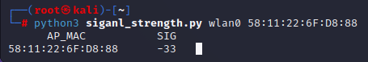

# signal_strength
Tested in Kali Linux 2022.4  

## Installation
```sh
pip3 install scapy
```

## Usage
python3 signal_strength.py [interface] [ap_mac]  
ex) python3 signal_strength.py wlan0 11:22:33:44:55:66  

